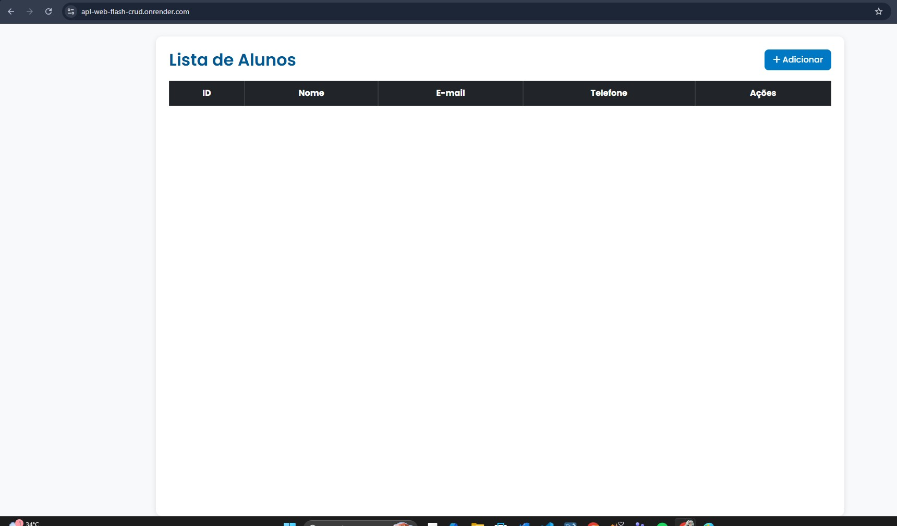
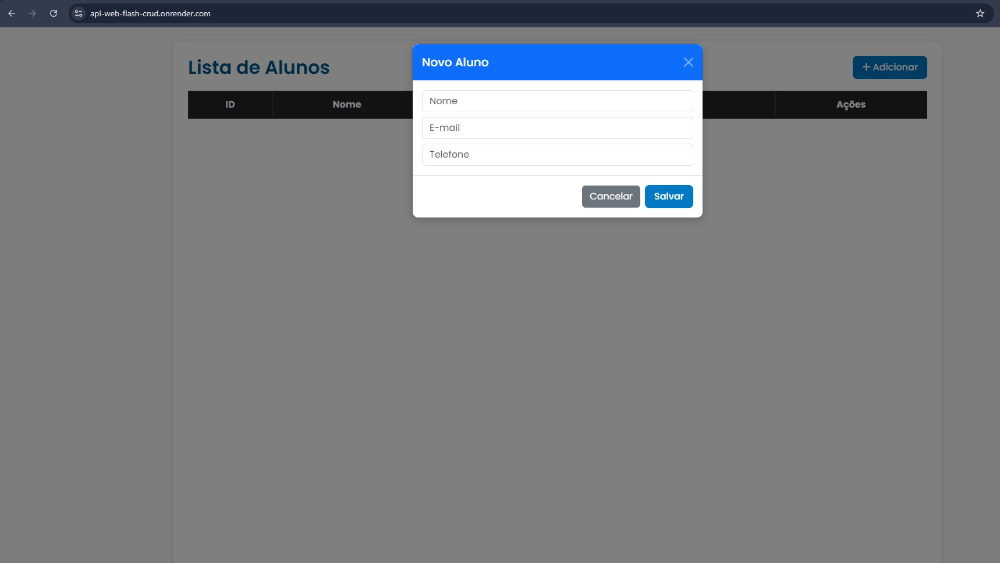

## 📌 Apl_Web_Flash_CRUD

Aplicação web CRUD desenvolvida com Flask e MySQL, utilizando banco de dados em nuvem pela Aiven e deploy no Render.

O sistema permite cadastrar, listar, atualizar e excluir alunos, com persistência de dados em banco de dados remoto e conexão segura.

## 🔗 Aplicação online:
https://apl-web-flash-crud.onrender.com

## 🖼️ Demonstração

      

🚀 Tecnologias Utilizadas

Python 3

Flask

PyMySQL

MySQL (Aiven Cloud)

HTML5 / CSS3

Gunicorn

Render (Deploy em nuvem)

## ⚙️ Funcionalidades

✅ Listagem de alunos cadastrados

➕ Cadastro de novos alunos

✏️ Atualização de dados

❌ Exclusão de registros

🔒 Conexão segura com MySQL (SSL)

☁️ Banco de dados em nuvem com controle de IP

## 🗄️ Estrutura da Tabela
CREATE TABLE students (
    id INT AUTO_INCREMENT PRIMARY KEY,
    name VARCHAR(100) NOT NULL,
    email VARCHAR(100) NOT NULL,
    phone VARCHAR(20) NOT NULL
);

## 🌐 Deploy e Infraestrutura

Backend: Flask + Gunicorn

Banco de dados: MySQL gerenciado na Aiven

Hospedagem: Render (plano gratuito)

## ⚠️ Observação: No plano free do Render, o serviço pode “hibernar” após inatividade, sendo reativado automaticamente no primeiro acesso.

🔐 Segurança

Variáveis sensíveis protegidas via Environment Variables

Acesso ao banco restrito por IP Allow List

Comunicação segura com SSL

## 👨‍💻 Autor

Bruno Molina Souza
Desenvolvedor em formação – Análise e Desenvolvimento de Sistemas
Projeto acadêmico e portfólio prático com Flask, banco de dados e deploy em nuvem.
